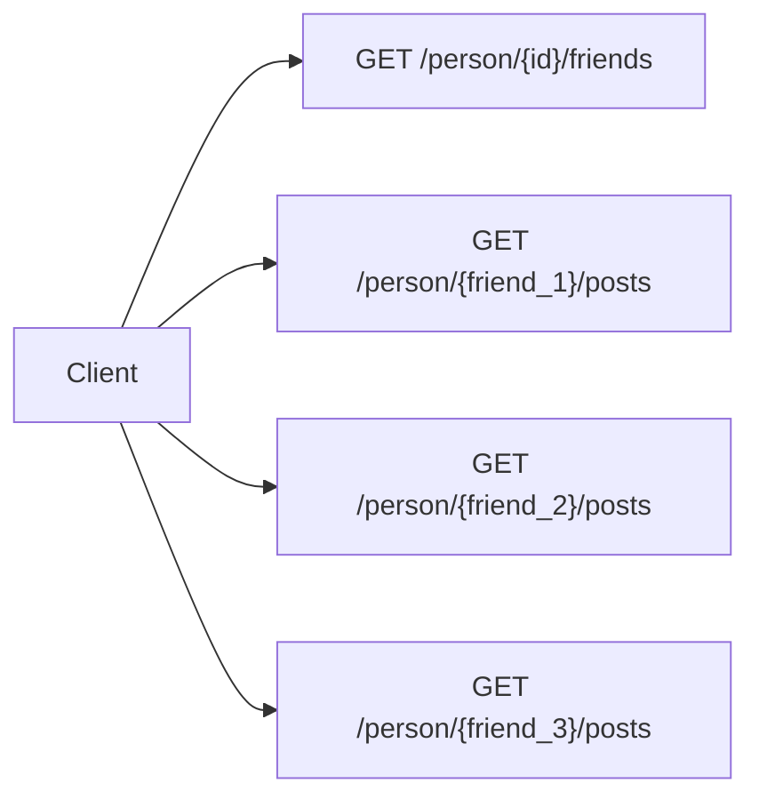
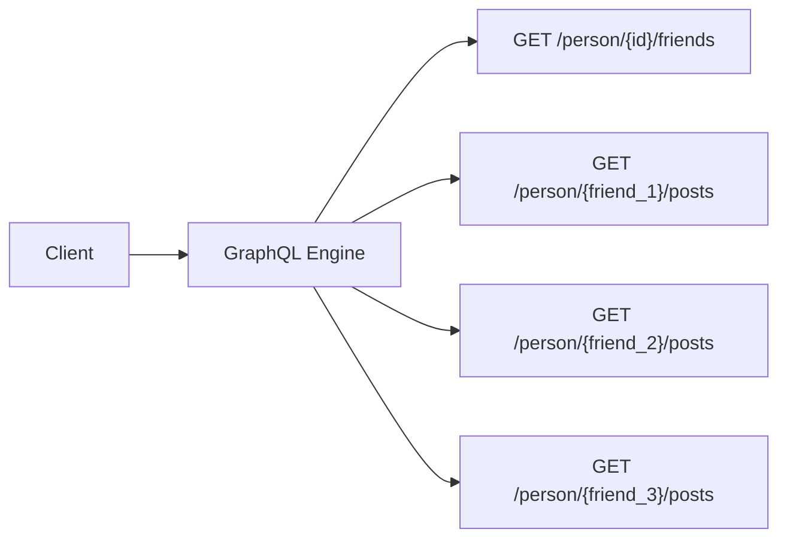

# GraphQL

Getting Started with GraphQL in Spring Boot Applications

<div class="mt-10 h-10 flex flex-row gap-5">
  
  
</div>

<div class="absolute bottom-0 mb-16"><a href="https://github.com/sonallux"><mdi-github /> github.com/sonallux</a></div>

<!--
- Was ist GraphQL?
- Wie funktioniert GraphQL?
- GraphQL Service mit Spring Boot schreiben
- Vorteile und Nachteile GraphQL
-->

---
layout: two-cols
---
# REST API

- `GET /person/{id}` : `Person`
- `GET /person/{id}/friends` : `Person[]`
- `GET /person/{id}/posts` : `Post[]`

<br>

```ts
interface Person {
  id: number
  name: string
  age: number
  aboutMe: string
}

interface Post {
  id: number
  author: number
  title: string
  content: string
  likes: number
}
```

::right::
<div v-click>

# Profil einer Person

- Name
- Alter
- Über mich
- Freunde: (Name)
- Posts: (Titel, Likes)

</div>
<div v-click class="pt-12">

## Probleme

- overfetching: zu viele Daten werden geladen
- underfetching: 3 Requests nötig

</div>

<!--
jeden Endpunkt einmal aufrufen
<br>
overfetching:
- von freunden wird nur `name` benötigt
- von posts wird nur `title` und `likes` benötigt
-->

---
layout: two-cols
---
# REST API

- `GET /person/{id}` : `Person`
- `GET /person/{id}/friends` : `Person[]`
- `GET /person/{id}/posts` : `Post[]`

<br>

```ts
interface Person {
  id: number
  name: string
  age: number
  aboutMe: string
}

interface Post {
  id: number
  author: number
  title: string
  content: string
  likes: number
}
```

::right::
<div v-click>

# Newsfeed für eine Person aufbauen

Liste mit Posts der Freunde
- Autor
- Titel
- Likes

</div>
<div v-click class="pt-12">

## Probleme

- overfetching: zu viele Daten werden geladen
- underfetching: N + 1 Requests

</div>

<!--
N + 1 Problem
- 1. einmal `GET /person/{id}/friends` um alle Freunde abzufragen
- 2. pro Freund `GET /person/{id}/posts` um die jeweiligen Posts abzufragen
-->

---

# GraphQL

- Datenabfrage- und Manipulationssprache
- Intern bei Facebook entwickelt, 2015 veröffentlich
- Schema basiert
- Stark typisiert
- Transportprotokoll unabhängig
- Sprachunabhägige Spezifikation[^1]

[^1]: https://spec.graphql.org

---

# Schema

```graphql {0-6|8-10|12-14|16-23|all}
type Person {
  id: ID!
  name: String!
  age: Int
  friends(limit: Int = 10, offset: Int = 0): [Person!]!
}

type Query {
  person(id: ID!): Person
}

type Mutation {
  addFriendship(personId: Id): Int
}

type Subscription {
  friendshipAdded: FriendshipEvent
}

type FriendshipEvent {
  person1Id: ID!
  person2Id: ID!
}
```

<!-- 
- Schema an Beispiel Person erklären
  - Felder jeweils Datentypen
  - Not Null mit '!'
  - Jedes Feld kann Argumente haben, die Antwort beeinflussen, z.B. Sortierung, Paging, ...
- Einstiegspunkte: Query, Mutation, Subscription
- Mutation dürfen nicht parallel ausgeführt werden
- Beispiel wie Abfragen funktionieren jetzt live zeigen
-->

---
layout: center
---

# Demo

<!--
- GraphiQL: "Swagger UI für GraphQL"
- Query, Mutation und Subscription in GraphiQL zeigen
- Mapping auf HTTP zeigen, Query in Postman absetzen
-->

---

# GraphQL over HTTP [^1]

- Working draft / proposal
- De facto Standard

<br>
<br>

- `POST /graphql` mit JSON Body, der die Query oder Mutation als String unter dem Key `query` enthält
- `GET /graphql` mit Queryparameter `query`, der die Query als String enthält
- Anwort jeweils ein JSON mit `data` und `errors` Key


[^1]: https://github.com/graphql/graphql-over-http

---

# GraphQL in der Java Welt

<div class="mb-8">

- **GraphQL Java**[^1]: reine Implementierung der Spezifikation
- **Spring for GraphQL**[^2]: Offizielle Integration von GraphQL in das Spring Ökosystem
- **Netflix DGS**[^3]: GraphQL Server für Spring Boot mit GraphQL Federation[^4] Unterstützung
- **GraphQL Java Kickstart** [^5]: Community Integration von GraphQL in Spring Boot

</div>

[^1]: https://www.graphql-java.com
[^2]: https://spring.io/projects/spring-graphql
[^3]: https://netflix.github.io/dgs
[^4]: https://www.apollographql.com/docs/federation/federation-spec
[^5]: https://github.com/graphql-java-kickstart/graphql-spring-boot

<!-- 
graphql-java: seit 2015

spring-graphql: 1.0.0 war im Mai mit Spring Boot 2.7.0

Netflix DGS: Open Source seit 2021; GraphQL Federation: Subgraphen auf mehrere Services aufteilen

GraphQL Java Kickstart: seit 2018

Alle setzen auf GraphQL Java auf
-->

---
layout: center
---

# Live Coding

---

# N+1 Problem



---

# N+1 Problem



---

<div class="mb-8">

# Lösung: DataLoader[^1]

- Utility für den Applikation Data Fetching Layer
- Batching
- Caching

</div>

[^1]: https://github.com/graphql/dataloader bzw. https://github.com/graphql-java/java-dataloader

---
layout: two-cols
---

# Vorteile

- Bei graphartige Daten
- viele (unbekannte) Clients, die jeweils anderen Sichten auf die Daten benötigen
- Schema Validierung
- Starke Typisierung
- Built-in Subscriptions

::right::

# Nachteile
- Overfetching und Underfetching oft nur verschoben
- HTTP Status Codes und Caching Mechanismen können nicht verwendet werden

<!--
GraphQL ohne Subscription kann nicht mehr als REST mit Schema (OpenAPI/Swagger), Validierung, Sichten über Queryparameter. 

GraphQL kann es nur "out of the box"
-->

---

# Fragen ?

<ul class="mt-20">
  <li><a href="https://www.youtube.com/watch?v=kVSYVhmvNCI"><mdi-youtube /> Spring Tips: Spring GraphQL</a></li>
  <li><a href="https://www.youtube.com/watch?v=gvIqFDNGgwU&list=PLgGXSWYM2FpNRPDQnAGfAHxMl3zUG2Run"><mdi-youtube /> Learn Spring for GraphQL with Josh Long</a></li>
  <li><a href="https://docs.spring.io/spring-graphql/docs/1.0.0/reference/html/"><mdi-file-document /> Spring for GraphQL Documentation</a></li>
  <li><a href="https://docs.spring.io/spring-boot/docs/current/reference/html/web.html#web.graphql"><mdi-file-document /> Spring Boot Documentation: Spring for GraphQL</a></li>
  <li><a href="https://github.com/sonallux/social-network-graphql-example"><mdi-github /> github.com/sonallux/social-network-graphql-example</a></li>
  <li><a href="https://github.com/sonallux/graphql-getting-started-presentation"><mdi-github /> github.com/sonallux/graphql-getting-started-presentation</a></li>
  
</ul>
